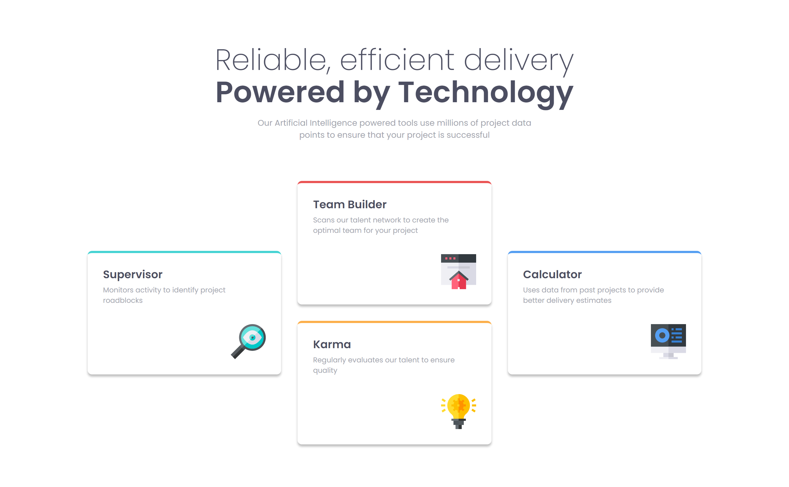

# Frontend Mentor - Four card feature section solution

This is a solution to the [Four card feature section challenge on Frontend Mentor](https://www.frontendmentor.io/challenges/four-card-feature-section-weK1eFYK). Frontend Mentor challenges help you improve your coding skills by building realistic projects. 

## Table of contents

- [Overview](#overview)
  - [The challenge](#the-challenge)
  - [Screenshot](#screenshot)
  - [Links](#links)
- [My process](#my-process)
  - [Built with](#built-with)
  - [What I learned](#what-i-learned)
  - [Continued development](#continued-development)
  - [Useful resources](#useful-resources)
- [Author](#author)

## Overview

### The challenge

Users should be able to:

- View the optimal layout for the site depending on their device's screen size

### Screenshot

### Links

- [Solution URL:](https://github.com/ralphvirtucio/four-card-feat-section)
- [Live Site URL:](https://ralphvirtucio.github.io/four-card-feat-section/)

## My process

### Built with

- Semantic HTML5 markup
- CSS custom properties
- Flexbox
- CSS Grid
- Mobile-first workflow
- SASS
- Cube CSS

### What I learned

The things that I learn while finishing this challenge are:

1. Use of Grid Column
    - I also learned that I can manipulate the grid even though the grid-template-row dont' have any value.

2. Cube CSS
    - This brilliant talk of Andy Bell's [“Be the browser’s mentor, not its micromanager"](https://www.youtube.com/watch?v=5uhIiI9Ld5M) really get met going to learn Cube CSS. I'm not sure if I did it correctly or follow any best practices.

### Continued development

I want to focus more in using Cube CSS, The simplicity, pragmatism and consistency really sway me to using it.

### Useful resources

- [Utopia Fluid Responsove Design](https://utopia.fyi/) - This helped me for calculating fluid font and fluid space.

## Author

- Website - [Ralph Virtucio](https://ralphvirtucio-portfolio.vercel.app)
- Frontend Mentor - [@ralphvirtucio](https://www.frontendmentor.io/profile/ralphvirtucio)
- Twitter - [@frontendralph](https://www.twitter.com/frontendralph)